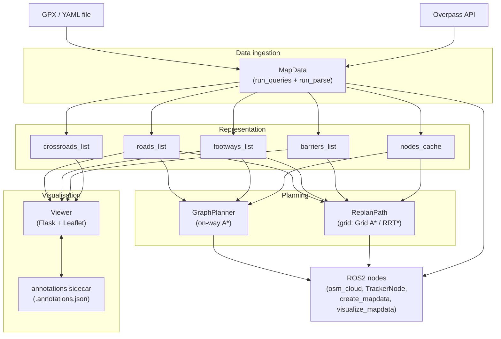

# Architecture Overview

This page describes the internal structure of the `map_data` package. The system is organised into four main layers: **data ingestion**, **representation**, **planning**, and **visualisation**.

---

## Component diagram

---

## MapData

`MapData` (defined in `map_data/map_data.py`) is the central data class. It accepts either a path to a `.gpx` (or `.yaml`) file or a pre-converted UTM coordinate array, queries the Overpass API for all OSM features inside the derived bounding box, and parses the responses into categorised `Way` lists.

**Overpass queries.** Three concurrent HTTP requests are fired in a thread pool:

- ways query — all OSM ways (roads, footways, barriers, buildings, etc.) plus their constituent nodes
- relations query — multipolygon relations that reference the above ways
- nodes query — all standalone point features (obstacle nodes)

The bounding box is the convex hull of the input waypoints expanded by `osm_margin + reserve_margin` metres on all sides (defaults: 100 m + 50 m).

**Core attributes after parsing:**

| Attribute | Type | Description |
|-----------|------|-------------|
| `roads_list` | `list[Way]` | Vehicle-intended highway ways, buffered to 7 m wide polygons |
| `footways_list` | `list[Way]` | Pedestrian footways, buffered to 3 m wide polygons |
| `barriers_list` | `list[Way]` | Physical barriers, buildings, water, and obstacle nodes |
| `crossroads_list` | `list[Way]` | Footway intersection points (buffered 1.5 m circles) |
| `nodes_cache` | `dict[int, dict]` | Mapping of OSM node ID to `{lat, lon, tags}` |
| `zone_number` | `int` | UTM zone number inferred from the input waypoints |
| `zone_letter` | `str` | UTM zone letter inferred from the input waypoints |
| `waypoints` | `np.ndarray` | `(N, 2)` UTM easting/northing array of the input waypoints |
| `min_x/max_x/min_y/max_y` | `float` | UTM bounding box including margins |

**Serialisation.** `MapData.save()` writes a JSON file (`.mapdata` extension) using `json.dump`. `MapData.load(path)` reads it back; it also transparently handles the legacy pickle format (detected by the `0x80` header byte) for backwards compatibility.

---

## Way objects

Every OSM feature is stored as a `Way` instance (`map_data/utils/way.py`). A `Way` holds:

- `id` — OSM way/node ID (positive integer) or a synthetic negative integer for merged multipolygon segments or viewer-drawn annotations
- `is_area` — `True` if the geometry is a closed polygon
- `nodes` — ordered list of OSM node IDs
- `tags` — dict of OSM tag key-value pairs
- `line` — Shapely geometry (`Polygon` for closed/buffered features, `LineString` for open features)
- `in_out` — `"outer"` or `"inner"` for multipolygon relation members

All geometry is stored in UTM coordinates (same zone as the input waypoints). Ways are buffered during parsing: roads receive a 7 m half-width buffer and footways a 3 m half-width buffer, converting `LineString` geometries to `Polygon`.

---

## Pathsolvers

The package provides two independent path-planning back-ends.

### GraphPlanner

`map_data/pathsolver/graph_planner.py`

Builds an undirected weighted graph directly from the OSM way network (`roads_list` and/or `footways_list`). Edge weights are Euclidean distances in metres. Planning uses A* with a straight-line distance heuristic.

Waypoints passed to `GraphPlanner.plan()` are first snapped to the nearest graph edge using an STRtree spatial index. Viewer-drawn annotation paths (negative-ID ways) are spliced into the graph by projecting their endpoints onto the nearest existing OSM edge and inserting synthetic junction nodes at the projection points.

This planner is well-suited for route planning on well-mapped pedestrian or road networks where staying on designated paths is required.

### ReplanPath

`map_data/pathsolver/replan.py`

Builds a cost raster (occupancy grid) at resolution `cell_size` metres. Each cell receives a cost based on:

- the OSM highway type and surface material of the nearest way within `max_path_dist` metres (see `highway_costs` and `surface_costs` in `planner_defaults.yaml`)
- a fixed `default_off_path_cost` for cells not covered by any way
- barrier polygons inflated by `inflate_obstacles` metres, set to cost 1.0 (impassable)

Two search algorithms are available on top of this grid:

- **Grid A*** (`map_data/pathsolver/grid_astar.py`) — fast, optimal on the discrete grid
- **RRT*** (`map_data/pathsolver/rrt_star.py`) — sampling-based, produces smoother paths in cluttered environments

Optional post-processing: Douglas-Peucker simplification (`simplify_path`) and gradient-descent smoothing (`smooth_path`).

---

## Viewer

The viewer (`map_data/viewer/`) is a single-page web application consisting of:

- **Flask back-end** (`app.py`, `routes.py`) — serves GeoJSON representations of the `MapData` contents, handles annotation CRUD operations, and exposes a `/export` endpoint that writes a human-readable JSON export of the annotated map
- **Leaflet front-end** — renders roads, footways, and barriers as coloured polygons on an OpenStreetMap tile layer; provides drawing tools for obstacle annotations and path annotations

**Sidecar annotation files.** All viewer edits are persisted alongside the `.mapdata` file as `<stem>.annotations.json`. This design keeps the binary/JSON map data immutable while allowing iterative annotation without re-running the Overpass query. The viewer merges the sidecar at load time to produce the rendered view.

---

## ROS2 nodes

| Node | File | Purpose |
|------|------|---------|
| `create_mapdata` | `map_data/create_mapdata.py` | CLI node: reads a GPX/YAML file, runs `MapData.run_all()`, writes the `.mapdata` file |
| `visualize_mapdata` | `map_data/visualize_mapdata.py` | CLI node: loads a `.mapdata` file and starts the Flask viewer |
| `osm_cloud` | `map_data/osm_cloud.py` | ROS2 node: publishes the parsed OSM features as `sensor_msgs/PointCloud2` messages for use in Nav2 or custom navigation stacks |
| `TrackerNode` | `map_data/viewer/ros_node.py` | ROS2 node embedded in the viewer: subscribes to robot pose and streams it to the Leaflet front-end via WebSocket for live position display |

---

## Data flow

A typical session follows this sequence:

1. **Create `.mapdata`** — run `create_mapdata` with a GPX waypoint file. The node queries Overpass, parses the OSM data, and writes `<name>.mapdata` to disk.
2. **Open viewer** — run `visualize_mapdata` with the `.mapdata` file. The Flask server starts and opens the map in a browser.
3. **Annotate** — use the viewer drawing tools to mark obstacles, draw alternative path segments, delete or hide erroneous ways, adjust node positions, and override OSM tags. Changes are saved automatically to `<name>.annotations.json`.
4. **Export** — click the Export button to produce `<name>.exported.mapdata`, a human-readable JSON snapshot of the annotated map suitable for downstream processing.
5. **Plan path** — instantiate `GraphPlanner` or `ReplanPath` with the loaded `MapData` object and call `plan()` with the desired waypoints.
